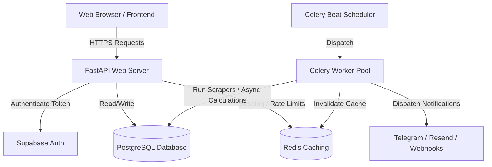

# TheFortFX — Backend Specification

## 1. Overview
TheFortFX is a production-grade backend for an AI-powered forex intelligence SaaS platform.
The architecture utilizes FastAPI as the core API framework, SQLAlchemy 2.0 with asyncpg for database operations, Supabase as the identity and storage provider, Redis for sliding window rate limiting and caching, and Celery for scheduled scraping and analysis tasks.

---

## 2. System Architecture & Flow

---

## 3. Database Schema

The database schema mirrors Supabase's PostgreSQL structure, with the following tables implemented as ORM models:

1. **Profiles (`profiles`)**:
   - `id` (UUID, PK referencing Auth)
   - `email` (Text, Unique)
   - `role` (Text check: free, premium, agency, admin)
   - `display_name`, `avatar_url`, `country`, `timezone`
   - `experience_level` (beginner, intermediate, advanced)
   - `risk_appetite` (low, medium, high)
   - `preferred_pairs` (varchar[])
   - `telegram_chat_id`, `webhook_secret`, `webhook_url`
   - `is_active` (boolean)
   - `last_seen_at`, `created_at`, `updated_at`

2. **Pairs (`pairs`)**:
   - `id` (UUID, PK)
   - `symbol` (Text, e.g. "EUR/USD", Unique)
   - `slug` (Text, e.g. "eurusd", Unique)
   - `display_name` (Text)
   - `base_currency`, `quote_currency` (Text)
   - `category` (major, minor, exotic, crypto, commodity)
   - `description` (Text)
   - `pip_decimal` (Integer)
   - `is_active` (Boolean)
   - `display_order` (Integer)

3. **Signals (`signals`) & History (`signal_history`)**:
   - Holds entry, stop loss, take profit targets, confidence, risk/reward metrics, direction (BUY/SELL/NEUTRAL), status (active, completed, expired, cancelled).

4. **Forecasts (`forecasts`)**:
   - Bullish/bearish score gauges, support/resistance levels list, timeframe, valid_until.

5. **Sentiment (`sentiment`)**:
   - Ratios of retail long/short, institutional bias logs.

6. **Opportunities (`opportunities`)**:
   - Calculated weighted rankings (trend 30%, retail sentiment 25%, consensus 25%, volatility 10%, news risk 10%).

7. **Economic Events (`economic_events`)**:
   - Economic calendar schedule, currency, impact rating, actual vs forecast, released status.

8. **News (`news`)**:
   - Financial articles, impact levels, affected pairs array, tags.

9. **Brokers (`brokers`)**:
   - Affiliate tracking, trust ratings, spread values, regulation list, platforms list.

10. **Watchlists (`watchlists`)**:
    - Users' watched currency pairs.

11. **Alerts (`alerts`) & Deliveries (`alert_deliveries`)**:
    - Real-time notification rules and delivery logs.

12. **Subscriptions (`subscriptions`)**:
    - Stripe active plans and renewal schedules.

13. **Audit Logs (`audit_logs`)**:
    - Administrator and system action history.

---

## 4. API Documentation

Complete endpoints mapped under `/api/v1`:

- `/health`: Health status.
- `/auth`: Supabase profile synchronizer.
- `/users`: Profile updates, trading stats.
- `/pairs`: Asset lists and latest summaries.
- `/signals`: Trade signals and historical versions.
- `/forecasts`: Timeframe forecasts and support levels.
- `/opportunities`: ranked list, top 10.
- `/sentiment`: retail/institutional sentiment ratios.
- `/economic-calendar`: upcoming volatility events.
- `/news`: financial headlines.
- `/calculators`: pip value, position sizing, drawdown, risk reward.
- `/watchlists`: user watched pairs.
- `/alerts`: user alert rule triggers.
- `/journal`: journal logs, win rate statistics.
- `/brokers`: broker ratings and comparisons.
- `/subscriptions`: Stripe portal links, plans, webhook.
- `/ai`: AI-powered trade viability analysis.
- `/admin`: admin analytics dashboard, broadcasts, bulk signals.
